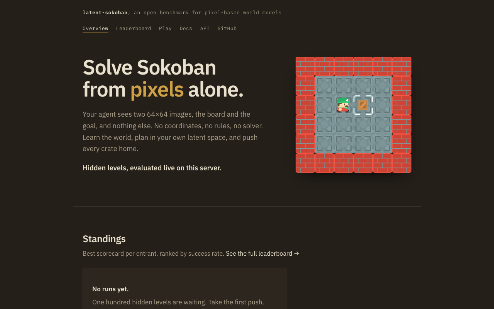
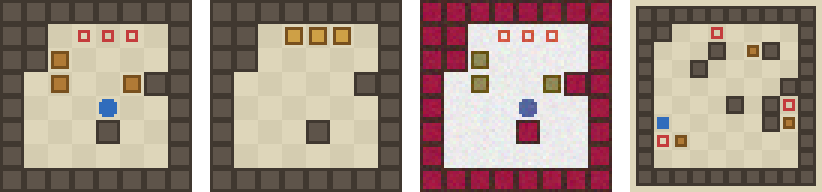
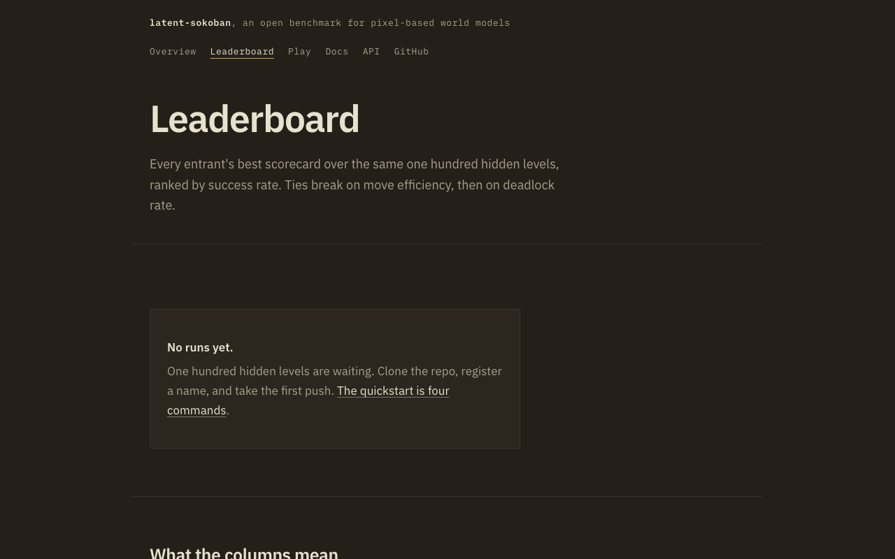
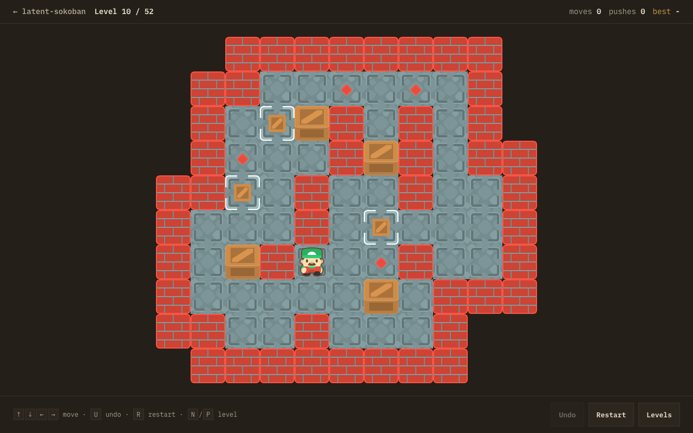

# Latent Sokoban Challenge

An open benchmark for **pixel-based latent world models**: agents see only
rendered images of the current and goal Sokoban boards, learn dynamics from
action-labelled trajectories, and plan in latent space.

**Live at [sokoban.lulzx.space](https://sokoban.lulzx.space)** with a public
leaderboard and evaluation API. Anyone can register a key and evaluate an
agent against 100 hidden levels held by the server:

```bash
python scripts/remote_eval.py --register "your-name"   # once: get an API key
export SOKOBAN_API_KEY=lsk-…
python scripts/remote_eval.py --agent my_pkg.agent:MyAgent
```

Full documentation: **[sokoban.lulzx.space/docs](https://sokoban.lulzx.space/docs/)**

[](https://sokoban.lulzx.space)

Why this is hard:
[SokoBench (arXiv:2601.20856)](https://arxiv.org/abs/2601.20856) shows even
frontier reasoning models degrade consistently on Sokoban past ~25-move
horizons. This benchmark deliberately lives in that regime, from pixels.



*Left to right: current observation (8×8, three boxes), goal observation
(player hidden), a Split-B visual-generalization theme, a 10×10 Split-C
board. All observations are 64×64 RGB.*

This repo is the neutral ground every entry is built on: same environment,
same dataset, same levels, same scoring script. Models and planners live in
each entrant's own repo.

## The hidden set

100 levels on an 8×8 board, ordered easiest first, generated once from a
secret seed and never leaving the server:

| Levels | Crates | Optimal solution | Wall density |
| --- | --- | --- | --- |
| 1–25 | 1 | 6–18 moves | 0.10 |
| 26–50 | 2 | 10–28 moves | 0.12 |
| 51–80 | 3 | 15–31 moves | 0.14 |
| 81–100 | 4 | 20–42 moves | 0.18 |

Each level's step budget is three times its own optimal solution.

Crate count carries the ramp because solution length cannot: at a fixed 3
crates on 8×8, sampling 400 levels puts the median optimal solution at 20
moves and the ceiling near 46, so sliding the length band alone would barely
separate level 1 from level 100. Each extra crate multiplies the reachable
state space and the number of ways to deadlock irreversibly. Board size
stays 8×8 so a 64×64 observation always means the same 8 pixels per tile.

Full measurements and rationale: [level generation](https://sokoban.lulzx.space/docs/level-generation/).

## Anti-brute-force design

The benchmark is deliberately sized so that brute force loses:

- **Planning is budgeted in counted dynamics calls, not wall-clock**: at
  most **256 learned-dynamics calls per action** (one call = one predicted
  transition of one candidate state; a batch of B rolled H steps costs
  B×H). Planners tick a shared `CallMeter`; the harness fails any episode
  that exceeds the cap and logs per-action counts into the results. Meter
  honesty is verified by source review of the frozen submission.
- **Decode-then-search is prohibited by rule**: no module may reconstruct
  an exact symbolic board at inference time or run graph search over
  enumerated discrete states, whether the decoder or transition function
  was hand-coded or learned. See [docs/RULES.md](docs/RULES.md).
- **Unplayed episodes count as unsolved.** Closing a scorecard pads the
  results to the full 100 with failures, so stopping a bad run early does
  not help and no favourable subset can be cherry-picked.

## The site

| Page | What it is |
| --- | --- |
| [`/`](https://sokoban.lulzx.space) | Overview, quickstart, rules |
| [`/leaderboard`](https://sokoban.lulzx.space/leaderboard) | Standings, with every metric defined |
| [`/play`](https://sokoban.lulzx.space/play) | Play Sokoban in the browser |
| [`/docs`](https://sokoban.lulzx.space/docs/) | Full documentation |
| [`/api/docs`](https://sokoban.lulzx.space/api/docs) | Swagger UI for the evaluation API |

| Leaderboard | Play |
| --- | --- |
| [](https://sokoban.lulzx.space/leaderboard) | [](https://sokoban.lulzx.space/play) |

`/play` runs 52 classic levels from
[morenod/sokoban](https://github.com/morenod/sokoban) (MIT), ordered easiest
first, with keyboard, swipe and on-screen controls, unlimited undo, and
progress kept in local storage. These are **not** the benchmark levels; the
hidden set is separate and stays on the server.

Board art is [Kenney's Sokoban pack](https://www.kenney.nl/assets/sokoban)
(CC0).

## What's here

| Component | Where | Notes |
| --- | --- | --- |
| Environment | `latent_sokoban/env.py` | Deterministic Sokoban (8×8, 1–4 crates), 4 actions, invalid actions are no-ops, ASCII level format |
| Renderer | `latent_sokoban/render.py` | Pure-numpy 64×64 RGB, themeable for visual generalization |
| Level generator | `latent_sokoban/levels.py` | Rejection sampling against a BFS solver; every level solvable, plus the hidden set's difficulty ramp |
| Solver | `latent_sokoban/solver.py` | Optimal BFS + deadlock detection (data generation and eval analysis only; never available to agents) |
| Dataset generator | `latent_sokoban/dataset.py`, `scripts/generate_dataset.py` | 50% random / 30% solver / 20% perturbed-solver trajectories, sharded `.npz` |
| Benchmark splits | `scripts/generate_levels.py` | Warmup W + splits A–D (+ optional E) |
| Hidden set | `scripts/generate_hidden.py` | Builds the 100-level ramp from a secret seed |
| Evaluation harness | `latent_sokoban/evaluation.py`, `scripts/evaluate.py` | Deterministic, multi-seed, enforces the dynamics-call budget |
| Agent interface | `latent_sokoban/agent.py` | The only contract an entry implements, including the `CallMeter` |
| Shared baseline | `baseline/` | CNN encoder, 128-d latent, residual MLP dynamics, VICReg-style regularization, beam-search MPC (needs PyTorch) |
| Evaluation API and site | `server/` | FastAPI app, landing page, leaderboard, game, docs hosting |
| Play level builder | `scripts/build_play_levels.py` | Parses the classic ASCII set into JSON for `/play` |
| Scoring script | `scripts/score.py` | The official 100-point formula (45S+20G+10M+10P+10D+5R) |
| Hidden-test commitment | `scripts/hidden_test.py` | Encrypt-and-commit a secret generation seed |
| Visualizer | `scripts/visualize.py` | Rollout contact sheets + per-step metadata |

The infrastructure's only dependency is numpy; the optional baseline adds
PyTorch, and the server adds FastAPI.

## Quickstart

```bash
pip install -e .

# generate the shared training dataset
python scripts/generate_dataset.py --out data/train --episodes 2000 --seed 13

# generate development benchmark splits A-D
python scripts/generate_levels.py --all --n 100 --seed 1001 --out levels/

# sanity-check the harness with the built-in random agent
python scripts/evaluate.py --agent random --splits levels/split_a.json --seeds 0 1 2
```

Run the test suite with `python -m pytest tests/`.

## The agent contract

Implement `latent_sokoban.agent.Agent` in your own repo:

```python
from latent_sokoban.agent import Agent

class MyAgent(Agent):
    def reset(self):
        ...  # called at the start of every episode

    def act(self, obs, goal, action_history) -> int:
        # obs, goal: (64, 64, 3) uint8 images. Return 0=up 1=down 2=left 3=right.
        z_next = self.dynamics(z_batch, actions)   # your world model
        self.call_meter.tick(len(z_batch))         # REQUIRED: count every
        ...                                        # dynamics forward pass
```

Then evaluate it:

```bash
python scripts/evaluate.py --agent my_submission.agent:MyAgent \
    --splits levels/split_a.json levels/split_b.json levels/split_c.json levels/split_d.json \
    --seeds 0 1 2 --out results.json
```

Agents receive **only** the current image, the goal image and their own action
history. Symbolic board state, coordinates, transition rules and solver access
are all off-limits at inference time (the solver is allowed for training-data
generation and post-hoc analysis).

## Shared baseline

`baseline/` implements the required baseline from the rulebook: a small
CNN encoder → 128-d latent, learned action embeddings, a residual MLP
dynamics model (`z' = z + f(z, a)`, 830k parameters total), a one-step
latent prediction loss with VICReg-style variance/covariance
regularization, and beam-search MPC scored by Euclidean latent distance
to the encoded goal image, replanning every action. Requires PyTorch
(`pip install -e ".[baseline]"`).

```bash
python baseline/train.py --data data/warmup --out baseline/checkpoint.pt --steps 5000 --seed 13
python scripts/evaluate.py --agent baseline.agent:BaselineAgent --splits levels/eval_w.json --seeds 0 1 2
```

Measured results (5,000 training steps, ~9 min on an M-series MPS; 50
warmup levels / 20 Split-A levels, 3 evaluation seeds):

| Agent | Split W (6×6, 1 box) | Split A (8×8, 3 boxes) | Plan time | Calls/action |
| --- | --- | --- | --- | --- |
| Random | 4% | 0% | - | 0 |
| Baseline | **12%** | **0%** | 3.6 ms | 84 |

This is also what calibrates the hidden set's ramp. Tier 1 (8×8, one crate)
sits between splits W and A, so the opening levels are not free but are
reachable; the closing tiers are out of reach of anything published. A
benchmark where every entrant scores zero everywhere gives no gradient to
improve against.

Two findings from instrumenting this baseline, so nobody has to
rediscover them:

- **Plan short, replan often.** One-step prediction is sharp (open-loop
  drift after 1 imagined step ≈ one true transition), but drift reaches
  the *entire* typical start-to-goal distance after ~6 imagined steps, so
  long beams score pure noise. The baseline therefore plans at horizon 3
  and relies on MPC replanning. Extending the usable horizon (multi-step
  rollout losses, better dynamics) is the single most obvious research
  direction.
- **Pure greedy oscillates.** The Euclidean distance field has local
  minima (any required detour temporarily increases distance), and a
  deterministic argmin planner parks in them, bouncing left–right
  forever. Even *oracle* dynamics with greedy latent distance only
  solves 16% of warmup levels. The baseline adds small seeded Gumbel
  noise (η = 0.2) to plan scores to break loops. Learned value/distance
  functions that understand detours are the second obvious direction.

## Benchmark splits

These public splits are for development and are separate from the hidden set:

| Split | Purpose | Configuration |
| --- | --- | --- |
| W | Warmup (unscored) | 6×6, 1 box; baseline-round sanity checks only |
| A | Core performance | 8×8, 3 boxes, training visual style, unseen layouts |
| B | Visual generalization | Split-A boards with randomized colours, checker patterns and pixel noise |
| C | Structural generalization | 10×10 boards, 3 boxes, longer optimal solutions |
| D | Deadlock avoidance | 8×8, 3 boxes; at least one reachable push is provably irreversible |
| E | Bonus: five boxes | 10×10, 5 boxes, 160-action horizon (`--split E`) |

The harness reports, per split, averaged over evaluation seeds: **success
rate** (primary metric), **move efficiency** (optimal ÷ agent moves, solved
levels only), **planning time** per action, **model calls** per action
(average, max, and cap violations), and **deadlock rate**.

Note the live server's deadlock rate is a **lower bound**: it uses a cheap
corner test rather than the exact bounded BFS, because the exact check would
block the request path. See [scoring](https://sokoban.lulzx.space/docs/scoring/).

## Dataset format

Each shard is an `.npz` with a `.json` sidecar (counts for data-budget
audits). Episodes are concatenated; `actions[i]` is the action taken *from*
`frames[i]` (`-1` marks the last frame of an episode), so
`(frames[i], actions[i], frames[i+1])` is a training transition whenever
`actions[i] != -1`. Shards also carry per-episode goal images, per-step
`pushed`/`invalid` flags, episode outcomes, trajectory kind (random / solver /
perturbed) and the ASCII levels for reproducibility. See
`latent_sokoban/dataset.py` for the full schema.

## Hidden test set protocol

The hidden set is generated once from a secret seed and held by the
evaluation server. Levels never leave it: agents receive rendered frames
only, and nobody plays them directly.

Because generation is fully determined by `(script, constraints, seed)`, the
seed alone is a commitment to the exact test levels. Publishing the seed when
a round closes lets anyone regenerate the set and verify what was scored,
without the levels having been visible while the round was open.

Rotating the seed replaces the whole set and invalidates every prior score,
so it happens only between rounds, and is announced.

## Running the server

```bash
pip install -e ".[docs]"
python scripts/generate_hidden.py --seed 123 --out server/hidden_levels.json
mkdocs build
SOKOBAN_SEED=123 uvicorn server.app:app --port 8321
```

Generating the hidden set takes about 70 seconds, nearly all of it in the
4-crate tier. The server will do it at boot if the file is missing, but the
API is unreachable while it does.

Operational detail, environment variables and deployment:
[running the server](https://sokoban.lulzx.space/docs/operations/).

## Competition rules (summary)

Full rules live in [docs/RULES.md](docs/RULES.md). Defaults: fixed shared
dataset, ≤20M parameters, ≤12 GPU-hours for the final run, ≤500 ms inference
per action, ≤256 counted dynamics calls per action, shared training seeds
{13, 42, 137}, scores averaged over ≥3 evaluation seeds. Final score:
45% standard success, 20% generalization, 10% move efficiency, 10% planning
speed, 10% deadlock avoidance, 5% reproducibility.

## Credits

- Board art: [Kenney](https://www.kenney.nl/assets/sokoban) (CC0)
- `/play` levels: [morenod/sokoban](https://github.com/morenod/sokoban) (MIT)
- Typeface: [IBM Plex](https://github.com/IBM/plex) (OFL 1.1)

## License

MIT
